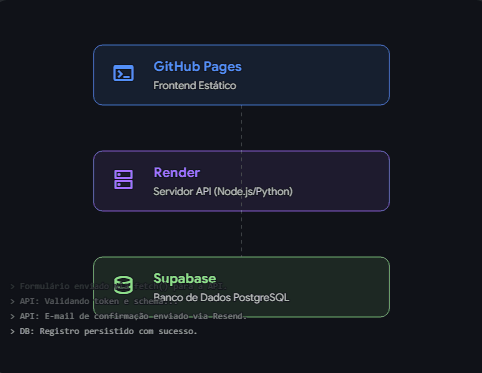

# 💻 Bruno Salustiano | Portfólio Full Stack

Este repositório contém o código-fonte do meu portfólio profissional. Este projeto foi desenvolvido utilizando uma **arquitetura moderna e desacoplada**, focada em performance, escalabilidade e adoção das melhores práticas de mercado para aplicações full stack.

🌍 **[Acesse o Portfólio ao vivo aqui](https://brunoferreirasalustiano.github.io/6-Portifolio-Bruno/)**

---

## 🏗️ Arquitetura Web Desacoplada (Decoupled Architecture)

Diferente de arquiteturas tradicionais e monolíticas, este sistema utiliza um modelo desacoplado, onde a interface (Frontend), o servidor de lógica (Backend API) e o banco de dados funcionam de forma independente, comunicando-se via APIs seguras.

### Visualização do Fluxo de Dados

Abaixo, um diagrama explicando o caminho que os dados percorrem desde o envio do formulário pelo usuário até a persistência segura no banco de dados.

### Explicação do Fluxo (Log de Eventos):

* **🌐 GitHub Pages (Frontend):** Recebe a interação do usuário. É hospedado globalmente via CDN, garantindo que o site carregue instantaneamente em qualquer lugar do mundo, sem latência.
* **⚙️ Render (Backend API):** É o cérebro da operação. Recebe os dados, valida rigorosamente o schema com a biblioteca **Zod**, orquestra o envio de e-mails transacionais (via **Resend API**) e gerencia a conexão com o banco de dados.
* **🗄️ Supabase (PostgreSQL):** É a camada de persistência. Funciona de forma independente do servidor de API, garantindo que os dados de contato sejam guardados com segurança e integridade em um banco de dados relacional.

---

## ✨ Funcionalidades Técnicas Principais

* **Validação de Dados:** Implementação do `Zod` no backend, criando um schema rigoroso para garantir a integridade e segurança dos dados de contato (evitando injeção de scripts e spam de dados inválidos).
* **Notificações Transacionais:** Integração com o serviço **Resend API** para envio automático de e-mails de notificação ao proprietário do portfólio assim que um novo contato é submetido.
* **Persistência Segura:** Configuração de tabelas e persistência de dados no **Supabase (PostgreSQL)**, funcionando como um banco de dados autônomo e seguro.
* **Segurança (CORS):** Backend blindado para aceitar requisições `POST` apenas da origem autorizada (o domínio do GitHub Pages).

---

## 👨‍💻 Autor

**Bruno Salustiano**
Desenvolvedor Full Stack especializado na construção de aplicações web funcionais, escaláveis e seguras, do banco de dados à interface UI/UX.

* **LinkedIn:** [https://www.linkedin.com/in/bfs-bruno/](https://www.linkedin.com/in/bfs-bruno/)
* **Localização:** Campinas, SP - Brasil
